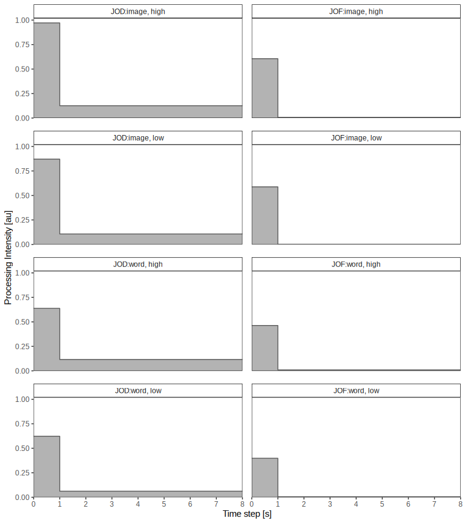
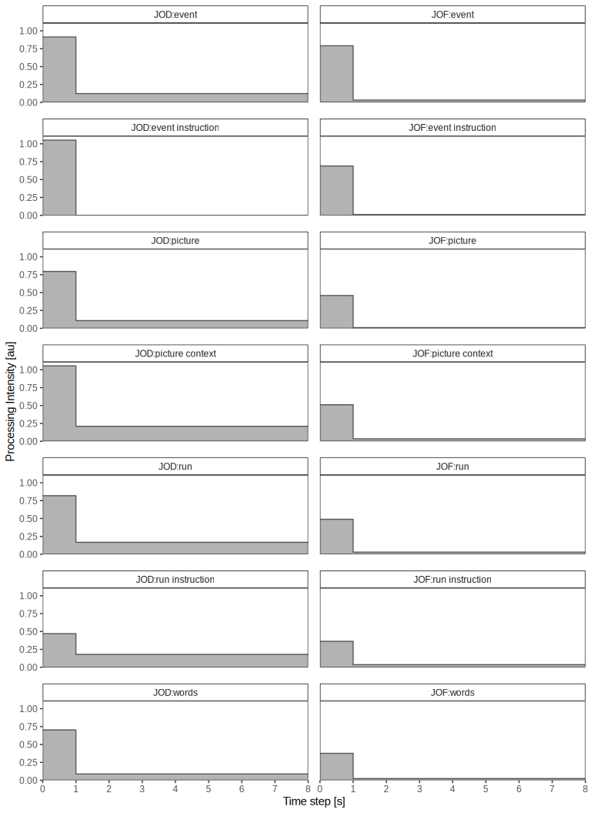
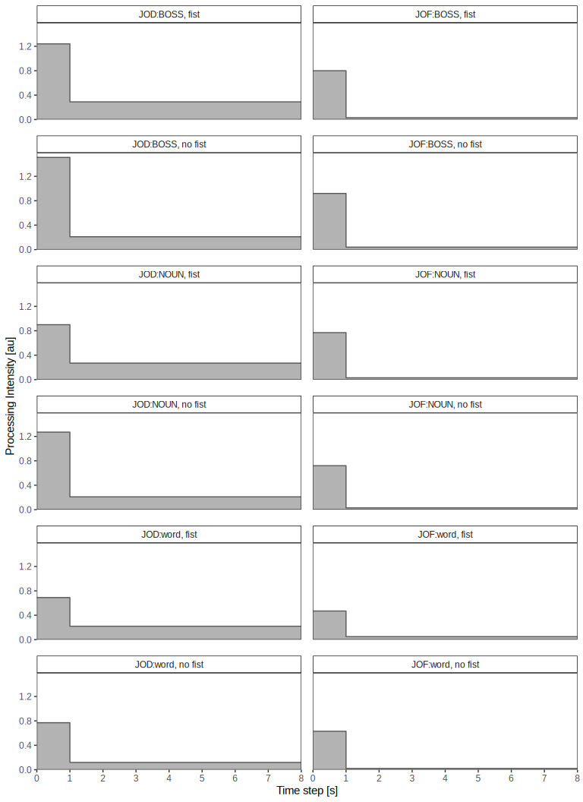

Attention Hypothesis in JOD and JOF
================
2026-05-16

## Prepare

Install librarian if you do not have it yet or use some other package
manager.

``` r
library(librarian)
shelf(readr, dplyr, MuMIn, sjPlot, lme4, tidyverse, xtable, ggplot2, latex2exp,
      Unicode, extrafont)
```

## Winkler

This csv contains only total duration as iv and dv.

``` r
w <- read_csv2("winkler.csv")
```

    ## ℹ Using "','" as decimal and "'.'" as grouping mark. Use `read_delim()` for more control.

    ## Rows: 8658 Columns: 17
    ## ── Column specification ───────────────────────────────────────────────────────────────────────────────────────────────────────────────────────────
    ## Delimiter: ";"
    ## chr (7): av, author, d_type, jod_type, stim_type, att_type, unique_id
    ## dbl (9): h, d, year, manuscript, experiment, vpnr, value, stim_id, id
    ## lgl (1): Beding
    ## 
    ## ℹ Use `spec()` to retrieve the full column specification for this data.
    ## ℹ Specify the column types or set `show_col_types = FALSE` to quiet this message.

``` r
# unique exp id for mixed model
w$exp_id <- paste(w$manuscript, w$experiment)
```

### JOF

``` r
mdl <- lmer(value ~ h + h:stim_type + h:att_type + h:stim_type:att_type + d+d:att_type + d:stim_type + d:stim_type:att_type + (1 +h+d| exp_id/vpnr), 
            data = w,
            subset = w$av == "jof")
```

    ## boundary (singular) fit: see help('isSingular')

``` r
summary(mdl)
```

    ## Linear mixed model fit by REML ['lmerMod']
    ## Formula: value ~ h + h:stim_type + h:att_type + h:stim_type:att_type +      d + d:att_type + d:stim_type + d:stim_type:att_type + (1 +  
    ##     h + d | exp_id/vpnr)
    ##    Data: w
    ##  Subset: w$av == "jof"
    ## 
    ## REML criterion at convergence: 16390.6
    ## 
    ## Scaled residuals: 
    ##     Min      1Q  Median      3Q     Max 
    ## -4.2354 -0.6363 -0.0588  0.5652  5.9670 
    ## 
    ## Random effects:
    ##  Groups      Name        Variance   Std.Dev. Corr        
    ##  vpnr:exp_id (Intercept) 2.09587605 1.447714             
    ##              h           0.02940575 0.171481 -0.18       
    ##              d           0.00010292 0.010145 -0.93 -0.21 
    ##  exp_id      (Intercept) 0.24759509 0.497589             
    ##              h           0.01403005 0.118449  0.08       
    ##              d           0.00001368 0.003698 -0.36  0.90 
    ##  Residual                1.91828540 1.385022             
    ## Number of obs: 4329, groups:  vpnr:exp_id, 406; exp_id, 6
    ## 
    ## Fixed effects:
    ##                              Estimate Std. Error t value
    ## (Intercept)                  2.493035   0.225475  11.057
    ## h                            0.598593   0.070366   8.507
    ## d                            0.007440   0.003395   2.192
    ## h:stim_typeword             -0.143288   0.055998  -2.559
    ## h:att_typelow               -0.017581   0.057554  -0.305
    ## att_typelow:d               -0.002918   0.003814  -0.765
    ## stim_typeword:d              0.005107   0.004092   1.248
    ## h:stim_typeword:att_typelow -0.047439   0.063844  -0.743
    ## stim_typeword:att_typelow:d  0.001591   0.005481   0.290
    ## 
    ## Correlation of Fixed Effects:
    ##             (Intr) h      d      h:stm_ h:tt_t att_t: stm_t: h:s_:_
    ## h           -0.016                                                 
    ## d           -0.260  0.164                                          
    ## h:stm_typwr  0.041 -0.663  0.154                                   
    ## h:att_typlw  0.000 -0.425  0.287  0.534                            
    ## att_typlw:d  0.000  0.209 -0.584 -0.263 -0.492                     
    ## stm_typwrd: -0.044  0.242 -0.514 -0.389 -0.238  0.485              
    ## h:stm_typ:_  0.004  0.367 -0.270 -0.603 -0.901  0.444  0.294       
    ## stm_typw:_: -0.017 -0.153  0.404  0.267  0.342 -0.696 -0.727 -0.408
    ## optimizer (nloptwrap) convergence code: 0 (OK)
    ## boundary (singular) fit: see help('isSingular')

``` r
r.squaredGLMM(mdl)
```

    ## Warning in vpnr:exp_id: numerical expression has 4329 elements: only the first used

    ##            R2m       R2c
    ## [1,] 0.2417397 0.6810632

``` r
tab_model(mdl, show.r2 = F, digits = 3, digits.re = 3)
```

<table style="border-collapse:collapse; border:none;">

<tr>

<th style="border-top: double; text-align:center; font-style:normal; font-weight:bold; padding:0.2cm;  text-align:left; ">

 
</th>

<th colspan="3" style="border-top: double; text-align:center; font-style:normal; font-weight:bold; padding:0.2cm; ">

value
</th>

</tr>

<tr>

<td style=" text-align:center; border-bottom:1px solid; font-style:italic; font-weight:normal;  text-align:left; ">

Predictors
</td>

<td style=" text-align:center; border-bottom:1px solid; font-style:italic; font-weight:normal;  ">

Estimates
</td>

<td style=" text-align:center; border-bottom:1px solid; font-style:italic; font-weight:normal;  ">

CI
</td>

<td style=" text-align:center; border-bottom:1px solid; font-style:italic; font-weight:normal;  ">

p
</td>

</tr>

<tr>

<td style=" padding:0.2cm; text-align:left; vertical-align:top; text-align:left; ">

(Intercept)
</td>

<td style=" padding:0.2cm; text-align:left; vertical-align:top; text-align:center;  ">

2.493
</td>

<td style=" padding:0.2cm; text-align:left; vertical-align:top; text-align:center;  ">

2.051 – 2.935
</td>

<td style=" padding:0.2cm; text-align:left; vertical-align:top; text-align:center;  ">

<strong>\<0.001</strong>
</td>

</tr>

<tr>

<td style=" padding:0.2cm; text-align:left; vertical-align:top; text-align:left; ">

h
</td>

<td style=" padding:0.2cm; text-align:left; vertical-align:top; text-align:center;  ">

0.599
</td>

<td style=" padding:0.2cm; text-align:left; vertical-align:top; text-align:center;  ">

0.461 – 0.737
</td>

<td style=" padding:0.2cm; text-align:left; vertical-align:top; text-align:center;  ">

<strong>\<0.001</strong>
</td>

</tr>

<tr>

<td style=" padding:0.2cm; text-align:left; vertical-align:top; text-align:left; ">

d
</td>

<td style=" padding:0.2cm; text-align:left; vertical-align:top; text-align:center;  ">

0.007
</td>

<td style=" padding:0.2cm; text-align:left; vertical-align:top; text-align:center;  ">

0.001 – 0.014
</td>

<td style=" padding:0.2cm; text-align:left; vertical-align:top; text-align:center;  ">

<strong>0.028</strong>
</td>

</tr>

<tr>

<td style=" padding:0.2cm; text-align:left; vertical-align:top; text-align:left; ">

h × stim type \[word\]
</td>

<td style=" padding:0.2cm; text-align:left; vertical-align:top; text-align:center;  ">

-0.143
</td>

<td style=" padding:0.2cm; text-align:left; vertical-align:top; text-align:center;  ">

-0.253 – -0.034
</td>

<td style=" padding:0.2cm; text-align:left; vertical-align:top; text-align:center;  ">

<strong>0.011</strong>
</td>

</tr>

<tr>

<td style=" padding:0.2cm; text-align:left; vertical-align:top; text-align:left; ">

h × att type \[low\]
</td>

<td style=" padding:0.2cm; text-align:left; vertical-align:top; text-align:center;  ">

-0.018
</td>

<td style=" padding:0.2cm; text-align:left; vertical-align:top; text-align:center;  ">

-0.130 – 0.095
</td>

<td style=" padding:0.2cm; text-align:left; vertical-align:top; text-align:center;  ">

0.760
</td>

</tr>

<tr>

<td style=" padding:0.2cm; text-align:left; vertical-align:top; text-align:left; ">

att type \[low\] × d
</td>

<td style=" padding:0.2cm; text-align:left; vertical-align:top; text-align:center;  ">

-0.003
</td>

<td style=" padding:0.2cm; text-align:left; vertical-align:top; text-align:center;  ">

-0.010 – 0.005
</td>

<td style=" padding:0.2cm; text-align:left; vertical-align:top; text-align:center;  ">

0.444
</td>

</tr>

<tr>

<td style=" padding:0.2cm; text-align:left; vertical-align:top; text-align:left; ">

stim type \[word\] × d
</td>

<td style=" padding:0.2cm; text-align:left; vertical-align:top; text-align:center;  ">

0.005
</td>

<td style=" padding:0.2cm; text-align:left; vertical-align:top; text-align:center;  ">

-0.003 – 0.013
</td>

<td style=" padding:0.2cm; text-align:left; vertical-align:top; text-align:center;  ">

0.212
</td>

</tr>

<tr>

<td style=" padding:0.2cm; text-align:left; vertical-align:top; text-align:left; ">

h × stim type \[word\] ×<br>att type \[low\]
</td>

<td style=" padding:0.2cm; text-align:left; vertical-align:top; text-align:center;  ">

-0.047
</td>

<td style=" padding:0.2cm; text-align:left; vertical-align:top; text-align:center;  ">

-0.173 – 0.078
</td>

<td style=" padding:0.2cm; text-align:left; vertical-align:top; text-align:center;  ">

0.457
</td>

</tr>

<tr>

<td style=" padding:0.2cm; text-align:left; vertical-align:top; text-align:left; ">

stim type \[word\] × att<br>type \[low\] × d
</td>

<td style=" padding:0.2cm; text-align:left; vertical-align:top; text-align:center;  ">

0.002
</td>

<td style=" padding:0.2cm; text-align:left; vertical-align:top; text-align:center;  ">

-0.009 – 0.012
</td>

<td style=" padding:0.2cm; text-align:left; vertical-align:top; text-align:center;  ">

0.772
</td>

</tr>

<tr>

<td colspan="4" style="font-weight:bold; text-align:left; padding-top:.8em;">

Random Effects
</td>

</tr>

<tr>

<td style=" padding:0.2cm; text-align:left; vertical-align:top; text-align:left; padding-top:0.1cm; padding-bottom:0.1cm;">

σ<sup>2</sup>
</td>

<td style=" padding:0.2cm; text-align:left; vertical-align:top; padding-top:0.1cm; padding-bottom:0.1cm; text-align:left;" colspan="3">

1.918
</td>

</tr>

<tr>

<td style=" padding:0.2cm; text-align:left; vertical-align:top; text-align:left; padding-top:0.1cm; padding-bottom:0.1cm;">

τ<sub>00</sub> <sub>vpnr:exp_id</sub>
</td>

<td style=" padding:0.2cm; text-align:left; vertical-align:top; padding-top:0.1cm; padding-bottom:0.1cm; text-align:left;" colspan="3">

2.096
</td>

<tr>

<td style=" padding:0.2cm; text-align:left; vertical-align:top; text-align:left; padding-top:0.1cm; padding-bottom:0.1cm;">

τ<sub>00</sub> <sub>exp_id</sub>
</td>

<td style=" padding:0.2cm; text-align:left; vertical-align:top; padding-top:0.1cm; padding-bottom:0.1cm; text-align:left;" colspan="3">

0.248
</td>

<tr>

<td style=" padding:0.2cm; text-align:left; vertical-align:top; text-align:left; padding-top:0.1cm; padding-bottom:0.1cm;">

τ<sub>11</sub> <sub>vpnr:exp_id.h</sub>
</td>

<td style=" padding:0.2cm; text-align:left; vertical-align:top; padding-top:0.1cm; padding-bottom:0.1cm; text-align:left;" colspan="3">

0.029
</td>

<tr>

<td style=" padding:0.2cm; text-align:left; vertical-align:top; text-align:left; padding-top:0.1cm; padding-bottom:0.1cm;">

τ<sub>11</sub> <sub>vpnr:exp_id.d</sub>
</td>

<td style=" padding:0.2cm; text-align:left; vertical-align:top; padding-top:0.1cm; padding-bottom:0.1cm; text-align:left;" colspan="3">

0.000
</td>

<tr>

<td style=" padding:0.2cm; text-align:left; vertical-align:top; text-align:left; padding-top:0.1cm; padding-bottom:0.1cm;">

τ<sub>11</sub> <sub>exp_id.h</sub>
</td>

<td style=" padding:0.2cm; text-align:left; vertical-align:top; padding-top:0.1cm; padding-bottom:0.1cm; text-align:left;" colspan="3">

0.014
</td>

<tr>

<td style=" padding:0.2cm; text-align:left; vertical-align:top; text-align:left; padding-top:0.1cm; padding-bottom:0.1cm;">

τ<sub>11</sub> <sub>exp_id.d</sub>
</td>

<td style=" padding:0.2cm; text-align:left; vertical-align:top; padding-top:0.1cm; padding-bottom:0.1cm; text-align:left;" colspan="3">

0.000
</td>

<tr>

<td style=" padding:0.2cm; text-align:left; vertical-align:top; text-align:left; padding-top:0.1cm; padding-bottom:0.1cm;">

ρ<sub>01</sub>
</td>

<td style=" padding:0.2cm; text-align:left; vertical-align:top; padding-top:0.1cm; padding-bottom:0.1cm; text-align:left;" colspan="3">

-0.177
</td>

<tr>

<td style=" padding:0.2cm; text-align:left; vertical-align:top; text-align:left; padding-top:0.1cm; padding-bottom:0.1cm;">

</td>

<td style=" padding:0.2cm; text-align:left; vertical-align:top; padding-top:0.1cm; padding-bottom:0.1cm; text-align:left;" colspan="3">

-0.927
</td>

<tr>

<td style=" padding:0.2cm; text-align:left; vertical-align:top; text-align:left; padding-top:0.1cm; padding-bottom:0.1cm;">

</td>

<td style=" padding:0.2cm; text-align:left; vertical-align:top; padding-top:0.1cm; padding-bottom:0.1cm; text-align:left;" colspan="3">

0.076
</td>

<tr>

<td style=" padding:0.2cm; text-align:left; vertical-align:top; text-align:left; padding-top:0.1cm; padding-bottom:0.1cm;">

</td>

<td style=" padding:0.2cm; text-align:left; vertical-align:top; padding-top:0.1cm; padding-bottom:0.1cm; text-align:left;" colspan="3">

-0.362
</td>

<tr>

<td style=" padding:0.2cm; text-align:left; vertical-align:top; text-align:left; padding-top:0.1cm; padding-bottom:0.1cm;">

N <sub>vpnr</sub>
</td>

<td style=" padding:0.2cm; text-align:left; vertical-align:top; padding-top:0.1cm; padding-bottom:0.1cm; text-align:left;" colspan="3">

251
</td>

<tr>

<td style=" padding:0.2cm; text-align:left; vertical-align:top; text-align:left; padding-top:0.1cm; padding-bottom:0.1cm;">

N <sub>exp_id</sub>
</td>

<td style=" padding:0.2cm; text-align:left; vertical-align:top; padding-top:0.1cm; padding-bottom:0.1cm; text-align:left;" colspan="3">

6
</td>

<tr>

<td style=" padding:0.2cm; text-align:left; vertical-align:top; text-align:left; padding-top:0.1cm; padding-bottom:0.1cm; border-top:1px solid;">

Observations
</td>

<td style=" padding:0.2cm; text-align:left; vertical-align:top; padding-top:0.1cm; padding-bottom:0.1cm; text-align:left; border-top:1px solid;" colspan="3">

4329
</td>

</tr>

</table>

### JOD

``` r
mdl <- lmer(value ~ h + h:stim_type + h:att_type + h:stim_type:att_type + d+d:att_type + d:stim_type + d:stim_type:att_type + (1 +h+d | exp_id/vpnr), 
            data = w,
            subset = w$av == "jod")
summary(mdl)
```

    ## Linear mixed model fit by REML ['lmerMod']
    ## Formula: value ~ h + h:stim_type + h:att_type + h:stim_type:att_type +      d + d:att_type + d:stim_type + d:stim_type:att_type + (1 +  
    ##     h + d | exp_id/vpnr)
    ##    Data: w
    ##  Subset: w$av == "jod"
    ## 
    ## REML criterion at convergence: 25548.7
    ## 
    ## Scaled residuals: 
    ##     Min      1Q  Median      3Q     Max 
    ## -3.1957 -0.6399 -0.0964  0.5897  7.2832 
    ## 
    ## Random effects:
    ##  Groups      Name        Variance  Std.Dev. Corr        
    ##  vpnr:exp_id (Intercept) 10.252592 3.20197              
    ##              h            0.188506 0.43417   0.03       
    ##              d            0.001091 0.03303  -0.37 -0.64 
    ##  exp_id      (Intercept) 14.474064 3.80448              
    ##              h            0.032347 0.17985  -0.18       
    ##              d            0.001056 0.03249  -0.72 -0.21 
    ##  Residual                16.418141 4.05193              
    ## Number of obs: 4329, groups:  vpnr:exp_id, 406; exp_id, 6
    ## 
    ## Fixed effects:
    ##                              Estimate Std. Error t value
    ## (Intercept)                 10.694205   1.575084   6.790
    ## h                            0.844719   0.159707   5.289
    ## d                            0.125742   0.020078   6.263
    ## h:stim_typeword             -0.322800   0.155615  -2.074
    ## h:att_typelow               -0.081098   0.157924  -0.514
    ## att_typelow:d               -0.000839   0.014122  -0.059
    ## stim_typeword:d             -0.019082   0.015619  -1.222
    ## h:stim_typeword:att_typelow  0.119968   0.175586   0.683
    ## stim_typeword:att_typelow:d -0.035307   0.019632  -1.798
    ## 
    ## Correlation of Fixed Effects:
    ##             (Intr) h      d      h:stm_ h:tt_t att_t: stm_t: h:s_:_
    ## h           -0.091                                                 
    ## d           -0.509 -0.347                                          
    ## h:stm_typwr -0.003 -0.812  0.297                                   
    ## h:att_typlw  0.000 -0.514  0.181  0.528                            
    ## att_typlw:d  0.000  0.255 -0.366 -0.262 -0.496                     
    ## stm_typwrd: -0.003  0.362 -0.499 -0.466 -0.233  0.470              
    ## h:stm_typ:_  0.000  0.441 -0.151 -0.595 -0.899  0.446  0.290       
    ## stm_typw:_: -0.004 -0.168  0.222  0.260  0.357 -0.719 -0.664 -0.437

``` r
r.squaredGLMM(mdl)
```

    ## Warning in vpnr:exp_id: numerical expression has 4329 elements: only the first used

    ##            R2m       R2c
    ## [1,] 0.1588739 0.6559433

``` r
tab_model(mdl, digits = 3, digits.re = 3)
```

<table style="border-collapse:collapse; border:none;">

<tr>

<th style="border-top: double; text-align:center; font-style:normal; font-weight:bold; padding:0.2cm;  text-align:left; ">

 
</th>

<th colspan="3" style="border-top: double; text-align:center; font-style:normal; font-weight:bold; padding:0.2cm; ">

value
</th>

</tr>

<tr>

<td style=" text-align:center; border-bottom:1px solid; font-style:italic; font-weight:normal;  text-align:left; ">

Predictors
</td>

<td style=" text-align:center; border-bottom:1px solid; font-style:italic; font-weight:normal;  ">

Estimates
</td>

<td style=" text-align:center; border-bottom:1px solid; font-style:italic; font-weight:normal;  ">

CI
</td>

<td style=" text-align:center; border-bottom:1px solid; font-style:italic; font-weight:normal;  ">

p
</td>

</tr>

<tr>

<td style=" padding:0.2cm; text-align:left; vertical-align:top; text-align:left; ">

(Intercept)
</td>

<td style=" padding:0.2cm; text-align:left; vertical-align:top; text-align:center;  ">

10.694
</td>

<td style=" padding:0.2cm; text-align:left; vertical-align:top; text-align:center;  ">

7.606 – 13.782
</td>

<td style=" padding:0.2cm; text-align:left; vertical-align:top; text-align:center;  ">

<strong>\<0.001</strong>
</td>

</tr>

<tr>

<td style=" padding:0.2cm; text-align:left; vertical-align:top; text-align:left; ">

h
</td>

<td style=" padding:0.2cm; text-align:left; vertical-align:top; text-align:center;  ">

0.845
</td>

<td style=" padding:0.2cm; text-align:left; vertical-align:top; text-align:center;  ">

0.532 – 1.158
</td>

<td style=" padding:0.2cm; text-align:left; vertical-align:top; text-align:center;  ">

<strong>\<0.001</strong>
</td>

</tr>

<tr>

<td style=" padding:0.2cm; text-align:left; vertical-align:top; text-align:left; ">

d
</td>

<td style=" padding:0.2cm; text-align:left; vertical-align:top; text-align:center;  ">

0.126
</td>

<td style=" padding:0.2cm; text-align:left; vertical-align:top; text-align:center;  ">

0.086 – 0.165
</td>

<td style=" padding:0.2cm; text-align:left; vertical-align:top; text-align:center;  ">

<strong>\<0.001</strong>
</td>

</tr>

<tr>

<td style=" padding:0.2cm; text-align:left; vertical-align:top; text-align:left; ">

h × stim type \[word\]
</td>

<td style=" padding:0.2cm; text-align:left; vertical-align:top; text-align:center;  ">

-0.323
</td>

<td style=" padding:0.2cm; text-align:left; vertical-align:top; text-align:center;  ">

-0.628 – -0.018
</td>

<td style=" padding:0.2cm; text-align:left; vertical-align:top; text-align:center;  ">

<strong>0.038</strong>
</td>

</tr>

<tr>

<td style=" padding:0.2cm; text-align:left; vertical-align:top; text-align:left; ">

h × att type \[low\]
</td>

<td style=" padding:0.2cm; text-align:left; vertical-align:top; text-align:center;  ">

-0.081
</td>

<td style=" padding:0.2cm; text-align:left; vertical-align:top; text-align:center;  ">

-0.391 – 0.229
</td>

<td style=" padding:0.2cm; text-align:left; vertical-align:top; text-align:center;  ">

0.608
</td>

</tr>

<tr>

<td style=" padding:0.2cm; text-align:left; vertical-align:top; text-align:left; ">

att type \[low\] × d
</td>

<td style=" padding:0.2cm; text-align:left; vertical-align:top; text-align:center;  ">

-0.001
</td>

<td style=" padding:0.2cm; text-align:left; vertical-align:top; text-align:center;  ">

-0.029 – 0.027
</td>

<td style=" padding:0.2cm; text-align:left; vertical-align:top; text-align:center;  ">

0.953
</td>

</tr>

<tr>

<td style=" padding:0.2cm; text-align:left; vertical-align:top; text-align:left; ">

stim type \[word\] × d
</td>

<td style=" padding:0.2cm; text-align:left; vertical-align:top; text-align:center;  ">

-0.019
</td>

<td style=" padding:0.2cm; text-align:left; vertical-align:top; text-align:center;  ">

-0.050 – 0.012
</td>

<td style=" padding:0.2cm; text-align:left; vertical-align:top; text-align:center;  ">

0.222
</td>

</tr>

<tr>

<td style=" padding:0.2cm; text-align:left; vertical-align:top; text-align:left; ">

h × stim type \[word\] ×<br>att type \[low\]
</td>

<td style=" padding:0.2cm; text-align:left; vertical-align:top; text-align:center;  ">

0.120
</td>

<td style=" padding:0.2cm; text-align:left; vertical-align:top; text-align:center;  ">

-0.224 – 0.464
</td>

<td style=" padding:0.2cm; text-align:left; vertical-align:top; text-align:center;  ">

0.494
</td>

</tr>

<tr>

<td style=" padding:0.2cm; text-align:left; vertical-align:top; text-align:left; ">

stim type \[word\] × att<br>type \[low\] × d
</td>

<td style=" padding:0.2cm; text-align:left; vertical-align:top; text-align:center;  ">

-0.035
</td>

<td style=" padding:0.2cm; text-align:left; vertical-align:top; text-align:center;  ">

-0.074 – 0.003
</td>

<td style=" padding:0.2cm; text-align:left; vertical-align:top; text-align:center;  ">

0.072
</td>

</tr>

<tr>

<td colspan="4" style="font-weight:bold; text-align:left; padding-top:.8em;">

Random Effects
</td>

</tr>

<tr>

<td style=" padding:0.2cm; text-align:left; vertical-align:top; text-align:left; padding-top:0.1cm; padding-bottom:0.1cm;">

σ<sup>2</sup>
</td>

<td style=" padding:0.2cm; text-align:left; vertical-align:top; padding-top:0.1cm; padding-bottom:0.1cm; text-align:left;" colspan="3">

16.418
</td>

</tr>

<tr>

<td style=" padding:0.2cm; text-align:left; vertical-align:top; text-align:left; padding-top:0.1cm; padding-bottom:0.1cm;">

τ<sub>00</sub> <sub>vpnr:exp_id</sub>
</td>

<td style=" padding:0.2cm; text-align:left; vertical-align:top; padding-top:0.1cm; padding-bottom:0.1cm; text-align:left;" colspan="3">

10.253
</td>

<tr>

<td style=" padding:0.2cm; text-align:left; vertical-align:top; text-align:left; padding-top:0.1cm; padding-bottom:0.1cm;">

τ<sub>00</sub> <sub>exp_id</sub>
</td>

<td style=" padding:0.2cm; text-align:left; vertical-align:top; padding-top:0.1cm; padding-bottom:0.1cm; text-align:left;" colspan="3">

14.474
</td>

<tr>

<td style=" padding:0.2cm; text-align:left; vertical-align:top; text-align:left; padding-top:0.1cm; padding-bottom:0.1cm;">

τ<sub>11</sub> <sub>vpnr:exp_id.h</sub>
</td>

<td style=" padding:0.2cm; text-align:left; vertical-align:top; padding-top:0.1cm; padding-bottom:0.1cm; text-align:left;" colspan="3">

0.189
</td>

<tr>

<td style=" padding:0.2cm; text-align:left; vertical-align:top; text-align:left; padding-top:0.1cm; padding-bottom:0.1cm;">

τ<sub>11</sub> <sub>vpnr:exp_id.d</sub>
</td>

<td style=" padding:0.2cm; text-align:left; vertical-align:top; padding-top:0.1cm; padding-bottom:0.1cm; text-align:left;" colspan="3">

0.001
</td>

<tr>

<td style=" padding:0.2cm; text-align:left; vertical-align:top; text-align:left; padding-top:0.1cm; padding-bottom:0.1cm;">

τ<sub>11</sub> <sub>exp_id.h</sub>
</td>

<td style=" padding:0.2cm; text-align:left; vertical-align:top; padding-top:0.1cm; padding-bottom:0.1cm; text-align:left;" colspan="3">

0.032
</td>

<tr>

<td style=" padding:0.2cm; text-align:left; vertical-align:top; text-align:left; padding-top:0.1cm; padding-bottom:0.1cm;">

τ<sub>11</sub> <sub>exp_id.d</sub>
</td>

<td style=" padding:0.2cm; text-align:left; vertical-align:top; padding-top:0.1cm; padding-bottom:0.1cm; text-align:left;" colspan="3">

0.001
</td>

<tr>

<td style=" padding:0.2cm; text-align:left; vertical-align:top; text-align:left; padding-top:0.1cm; padding-bottom:0.1cm;">

ρ<sub>01</sub>
</td>

<td style=" padding:0.2cm; text-align:left; vertical-align:top; padding-top:0.1cm; padding-bottom:0.1cm; text-align:left;" colspan="3">

0.027
</td>

<tr>

<td style=" padding:0.2cm; text-align:left; vertical-align:top; text-align:left; padding-top:0.1cm; padding-bottom:0.1cm;">

</td>

<td style=" padding:0.2cm; text-align:left; vertical-align:top; padding-top:0.1cm; padding-bottom:0.1cm; text-align:left;" colspan="3">

-0.375
</td>

<tr>

<td style=" padding:0.2cm; text-align:left; vertical-align:top; text-align:left; padding-top:0.1cm; padding-bottom:0.1cm;">

</td>

<td style=" padding:0.2cm; text-align:left; vertical-align:top; padding-top:0.1cm; padding-bottom:0.1cm; text-align:left;" colspan="3">

-0.180
</td>

<tr>

<td style=" padding:0.2cm; text-align:left; vertical-align:top; text-align:left; padding-top:0.1cm; padding-bottom:0.1cm;">

</td>

<td style=" padding:0.2cm; text-align:left; vertical-align:top; padding-top:0.1cm; padding-bottom:0.1cm; text-align:left;" colspan="3">

-0.720
</td>

<tr>

<td style=" padding:0.2cm; text-align:left; vertical-align:top; text-align:left; padding-top:0.1cm; padding-bottom:0.1cm;">

ICC
</td>

<td style=" padding:0.2cm; text-align:left; vertical-align:top; padding-top:0.1cm; padding-bottom:0.1cm; text-align:left;" colspan="3">

0.591
</td>

<tr>

<td style=" padding:0.2cm; text-align:left; vertical-align:top; text-align:left; padding-top:0.1cm; padding-bottom:0.1cm;">

N <sub>vpnr</sub>
</td>

<td style=" padding:0.2cm; text-align:left; vertical-align:top; padding-top:0.1cm; padding-bottom:0.1cm; text-align:left;" colspan="3">

251
</td>

<tr>

<td style=" padding:0.2cm; text-align:left; vertical-align:top; text-align:left; padding-top:0.1cm; padding-bottom:0.1cm;">

N <sub>exp_id</sub>
</td>

<td style=" padding:0.2cm; text-align:left; vertical-align:top; padding-top:0.1cm; padding-bottom:0.1cm; text-align:left;" colspan="3">

6
</td>

<tr>

<td style=" padding:0.2cm; text-align:left; vertical-align:top; text-align:left; padding-top:0.1cm; padding-bottom:0.1cm; border-top:1px solid;">

Observations
</td>

<td style=" padding:0.2cm; text-align:left; vertical-align:top; padding-top:0.1cm; padding-bottom:0.1cm; text-align:left; border-top:1px solid;" colspan="3">

4329
</td>

</tr>

<tr>

<td style=" padding:0.2cm; text-align:left; vertical-align:top; text-align:left; padding-top:0.1cm; padding-bottom:0.1cm;">

Marginal R<sup>2</sup> / Conditional R<sup>2</sup>
</td>

<td style=" padding:0.2cm; text-align:left; vertical-align:top; padding-top:0.1cm; padding-bottom:0.1cm; text-align:left;" colspan="3">

0.159 / 0.656
</td>

</tr>

</table>

## Betsch

Helpers for bootstrap regression:

``` r
one_bootstrap <- function(b) {
  b$dv_boot <- rnorm(nrow(b), b$dv, b$sd / sqrt(b$n))
  fits <- lmList(dv_boot ~ f + d|condition2, data = b)
  return(coef(fits))
}

bootstrap <- function(b, n) {
  list <- lapply(1:n, function(x) one_bootstrap(b))
  df <- do.call(rbind.data.frame, list)
  df$condition2 = gsub("[[:digit:]]+", "", rownames(df))
  df %>% 
    group_by(condition2) %>% 
    summarize_at(c("f", "d"),
                 list(mean = mean, se = sd,#), #)
                      `95%-LL` = function(x) quantile(x, 0.025),
                      `95%-UL` = function(x) quantile(x, 0.975)))
}

compare_betas <- function(beta1, se1, beta2, se2) {
  z <- (beta1 - beta2) / sqrt(se1^2 + se2^2)
  p <- 2 * (1 - pnorm(abs(z)))
  return(c(z = z, p = p))
}

# Example
compare_betas(beta1 = 0.5, se1 = 0.1, beta2 = 0.2, se2 = 0.15)
```

    ##          z          p 
    ## 1.66410059 0.09609233

## JOD

``` r
set.seed(899)
b <- read.csv("betsch2010.csv")
# exp1 is already in winkler (condition none)

b <- filter(b, jod_type != "single", dv_type == "jod",
            condition != "grand_mean", condition != "mean", 
            condition != "mean_after",
            condition != "mean_before", condition != "none")

b <- mutate(b, condition2 = gsub("_before|_after|_instr", "", condition))
b <- mutate(b, condition2 = gsub("_before|_after", "", condition))

lm <- lmList(dv ~ f + d|condition2, data = b)
coef(lm)
```

    ##             (Intercept)         f           d
    ## event          5.720417 0.8035417  0.12312500
    ## event_instr    6.682917 1.0697917 -0.02187500
    ## pic            9.715000 0.6917857  0.10812500
    ## pic-context    7.978333 0.8477381  0.20927083
    ## run            7.575000 0.6575000  0.15750000
    ## run_instr      8.026250 0.2981250  0.17750000
    ## words         10.265000 0.6148810  0.08833333

``` r
boot <- bootstrap(b, 1000)

purrr::map2(boot$f_mean, boot$f_se, \(x, y) compare_betas(boot$f_mean[2], boot$f_se[2], x, y))
```

    ## [[1]]
    ##         z         p 
    ## 0.5750939 0.5652278 
    ## 
    ## [[2]]
    ## z p 
    ## 0 1 
    ## 
    ## [[3]]
    ##         z         p 
    ## 1.0245833 0.3055598 
    ## 
    ## [[4]]
    ##         z         p 
    ## 0.6028285 0.5466228 
    ## 
    ## [[5]]
    ##         z         p 
    ## 0.5697341 0.5688581 
    ## 
    ## [[6]]
    ##          z          p 
    ## 1.68740908 0.09152472 
    ## 
    ## [[7]]
    ##         z         p 
    ## 1.2125590 0.2252985

``` r
purrr::map2(boot$d_mean, boot$d_se, \(x, y) compare_betas(boot$d_mean[4], boot$d_se[4], x, y))
```

    ## [[1]]
    ##         z         p 
    ## 0.5273256 0.5979675 
    ## 
    ## [[2]]
    ##          z          p 
    ## 1.95774272 0.05026021 
    ## 
    ## [[3]]
    ##           z           p 
    ## 2.577105894 0.009963142 
    ## 
    ## [[4]]
    ## z p 
    ## 0 1 
    ## 
    ## [[5]]
    ##         z         p 
    ## 0.1975565 0.8433920 
    ## 
    ## [[6]]
    ##         z         p 
    ## 0.2621588 0.7931990 
    ## 
    ## [[7]]
    ##           z           p 
    ## 3.089167237 0.002007184

``` r
boot <- boot %>%
    rename(condition = condition2) %>%
    select(-f_se, -d_se)

boot_jod <- boot
saveRDS(boot_jod, "boot_betsch_jod.RData")

boot_jod
```

    ## # A tibble: 7 × 7
    ##   condition   f_mean  d_mean `f_95%-LL` `d_95%-LL` `f_95%-UL` `d_95%-UL`
    ##   <chr>        <dbl>   <dbl>      <dbl>      <dbl>      <dbl>      <dbl>
    ## 1 event        0.791  0.122       0.151    -0.201       1.42       0.431
    ## 2 event_instr  1.07  -0.0196      0.331    -0.250       1.76       0.195
    ## 3 pic          0.687  0.107       0.545     0.0521      0.838      0.170
    ## 4 pic-context  0.846  0.210       0.707     0.154       0.994      0.261
    ## 5 run          0.652  0.167      -0.608    -0.247       1.89       0.574
    ## 6 run_instr    0.291  0.180      -0.240    -0.0236      0.836      0.402
    ## 7 words        0.616  0.0879      0.455     0.0287      0.771      0.146

``` r
print(xtable(boot, type = "latex", digits = 3), file = "betsch_jod.tex")
```

## JOF

``` r
b <- read.csv("betsch2010.csv")
# exp1 is already in winkler (condition none)

b <- filter(b, jod_type != "single", dv_type == "jof",
            condition != "grand_mean", condition != "mean", condition != "mean_after",
            condition != "mean_before", condition != "none")

b <- mutate(b, condition2 = gsub("_before|_after|_instr", "", condition))
b <- mutate(b, condition2 = gsub("_before|_after", "", condition))

lm <- lmList(dv ~ f + d|condition2, data = b)
coef(lm)
```

    ##             (Intercept)         f          d
    ## event          2.293750 0.7518750 0.03000000
    ## event_instr    2.740000 0.6800000 0.01250000
    ## pic            2.242500 0.4498214 0.00937500
    ## pic-context    1.992500 0.4757738 0.03447917
    ## run            2.804167 0.4504167 0.02937500
    ## run_instr      3.115833 0.3295833 0.03562500
    ## words          2.450000 0.3530952 0.02375000

``` r
boot <- bootstrap(b, 1000)
boot
```

    ## # A tibble: 7 × 9
    ##   condition2  f_mean  d_mean   f_se    d_se `f_95%-LL` `d_95%-LL` `f_95%-UL` `d_95%-UL`
    ##   <chr>        <dbl>   <dbl>  <dbl>   <dbl>      <dbl>      <dbl>      <dbl>      <dbl>
    ## 1 event        0.759 0.0320  0.253  0.0800       0.269   -0.133        1.25      0.181 
    ## 2 event_instr  0.679 0.0113  0.176  0.0635       0.329   -0.117        1.01      0.132 
    ## 3 pic          0.449 0.00929 0.0236 0.00874      0.405   -0.00740      0.495     0.0268
    ## 4 pic-context  0.476 0.0347  0.0241 0.00911      0.433    0.0169       0.525     0.0518
    ## 5 run          0.459 0.0298  0.131  0.0374       0.201   -0.0500       0.717     0.101 
    ## 6 run_instr    0.326 0.0366  0.111  0.0347       0.109   -0.0286       0.556     0.106 
    ## 7 words        0.353 0.0232  0.0272 0.00967      0.300    0.00491      0.406     0.0425

``` r
purrr:::map2(boot$f_mean, boot$f_se, \(x, y) compare_betas(boot$f_mean[1], boot$f_se[1], x, y))
```

    ## [[1]]
    ## z p 
    ## 0 1 
    ## 
    ## [[2]]
    ##         z         p 
    ## 0.2593853 0.7953380 
    ## 
    ## [[3]]
    ##        z        p 
    ## 1.218866 0.222895 
    ## 
    ## [[4]]
    ##         z         p 
    ## 1.1127777 0.2658039 
    ## 
    ## [[5]]
    ##        z        p 
    ## 1.053891 0.291933 
    ## 
    ## [[6]]
    ##         z         p 
    ## 1.5661120 0.1173224 
    ## 
    ## [[7]]
    ##         z         p 
    ## 1.5955033 0.1105997

``` r
purrr:::map2(boot$d_mean, boot$d_se, \(x, y) compare_betas(boot$d_mean[1], boot$d_se[1], x, y))
```

    ## [[1]]
    ## z p 
    ## 0 1 
    ## 
    ## [[2]]
    ##         z         p 
    ## 0.2026622 0.8393991 
    ## 
    ## [[3]]
    ##         z         p 
    ## 0.2825633 0.7775116 
    ## 
    ## [[4]]
    ##           z           p 
    ## -0.03316312  0.97354451 
    ## 
    ## [[5]]
    ##          z          p 
    ## 0.02525496 0.97985160 
    ## 
    ## [[6]]
    ##          z          p 
    ## -0.0517288  0.9587448 
    ## 
    ## [[7]]
    ##         z         p 
    ## 0.1094149 0.9128734

``` r
boot <- boot %>%
    rename(condition = condition2) %>%
    select(-f_se, -d_se)

print(xtable(boot, type = "latex", digits = 3), file = "betsch_jof.tex")

boot_jof <- boot
boot_jof
```

    ## # A tibble: 7 × 7
    ##   condition   f_mean  d_mean `f_95%-LL` `d_95%-LL` `f_95%-UL` `d_95%-UL`
    ##   <chr>        <dbl>   <dbl>      <dbl>      <dbl>      <dbl>      <dbl>
    ## 1 event        0.759 0.0320       0.269   -0.133        1.25      0.181 
    ## 2 event_instr  0.679 0.0113       0.329   -0.117        1.01      0.132 
    ## 3 pic          0.449 0.00929      0.405   -0.00740      0.495     0.0268
    ## 4 pic-context  0.476 0.0347       0.433    0.0169       0.525     0.0518
    ## 5 run          0.459 0.0298       0.201   -0.0500       0.717     0.101 
    ## 6 run_instr    0.326 0.0366       0.109   -0.0286       0.556     0.106 
    ## 7 words        0.353 0.0232       0.300    0.00491      0.406     0.0425

``` r
saveRDS(boot_jof, "boot_betsch_jof.RData")
```

## Attention functions

Helpers:

``` r
loadfonts()
times <- u_char_inspect(u_char_from_name("MULTIPLICATION SIGN"))["Char"]

create_attention <- function(duration, attention_high, attention_low, time_drop) {
  first <- rep(attention_high, time_drop)
  second <- rep(attention_low, duration - time_drop)
  
  data.frame(
    a = c(first, second),
    t = 0:(duration - 1)
  )
}

plot_attention <- function(res_df, base_theme = theme_bw()) {
  res_df$a <- pmax(res_df$a, 0)
  res_step <- res_df |>
    dplyr::group_by(.id) |>
    dplyr::arrange(t, .by_group = TRUE) |>
    dplyr::reframe(
      t = c(t, max(t) + 1),
      a = c(a, dplyr::last(a))
    )
  res_poly <- res_df |>
    dplyr::group_by(.id) |>
    dplyr::arrange(t, .by_group = TRUE) |>
    dplyr::reframe(
      x = c(
        0,
        as.vector(rbind(t, t + 1)),
        max(t) + 1,
        0
      ),
      y = c(
        0,
        as.vector(rbind(a, a)),
        0,
        0
      )
    )
  y_max <- max(res_df$a) * 1.05
  ggplot(res_df, aes(t, a)) +
    
    geom_polygon(
      data = res_poly,
      aes(x = x, y = y, group = .id),
      fill = "grey65",
      alpha = 0.85,
      colour = NA,
      inherit.aes = FALSE
    ) +
    
    geom_step(
      data = res_step,
      aes(t, a, group = .id),
      linewidth = 0.5,
      direction = "hv",
      colour = "grey35",
      inherit.aes = FALSE
    ) +
    
    facet_wrap(~ .id, ncol = 2, dir = "v") +
    
    scale_y_continuous(
      "Processing Intensity [au]",
      expand = c(0, 0),
      limits = c(0, y_max)
    ) +
    
    scale_x_continuous(
      "Time step [s]",
      breaks = 0:8,
      limits = c(0, 8),
      expand = c(0, 0)
    ) +
    
    base_theme +
    
    theme(
      legend.position = "none",
      strip.background = element_rect(
        colour = "black",
        fill = "white"
      ),
      panel.grid = element_blank(),
      
      panel.spacing.y = unit(1.1, "lines"),
      panel.spacing.x = unit(0.8, "lines")
    )
}
```

### Winkler

``` r
res <- Map(
  create_attention,
  duration = 8,
  attention_high = c(0.599 - c(0, 0.143, 0.018, 0.143 + 0.018 + 0.047)) + 0.007,
  attention_low = 0.007 + c(0, 0.003, -0.005, -0.002),
  time_drop = 1
)

names(res) <- paste0("JOF:", c("image, high", "word, high", "image, low", "word, low"))
res_df <- plyr::ldply(res, "data.frame")

b2 <- c(0.845 + c(0, -0.323, -0.081, -0.323 - 0.081 + 0.120))
b1 <- c(0.126 + c(0, -0.01, -0.019, -0.01 - 0.019 - 0.035))

b1 / 0.126
```

    ## [1] 1.0000000 0.9206349 0.8492063 0.4920635

``` r
(b1 + b2) / (0.845 + 0.126)
```

    ## [1] 1.0000000 0.6570546 0.8970134 0.6416066

``` r
res <- Map(
  create_attention,
  duration = 8,
  attention_high = b1 + b2,
  attention_low = b1,
  time_drop = 1
)

names(res) <- paste0("JOD:", c("image, high", "word, high", "image, low", "word, low"))
res_df_jod <- plyr::ldply(res, "data.frame")

res_df <- dplyr::bind_rows(res_df, res_df_jod)

p2 <- plot_attention(res_df)

p2
```

<!-- -->

``` r
pdf("plots/winkler.pdf", width = 8, height = 9)
p2
dev.off()
```

    ## png 
    ##   2

### Betsch

``` r
all <- dplyr::bind_rows(boot_jod, boot_jof, .id = "dv")

fac <- factor(all$condition)
fac <- forcats::fct_reorder(fac, all$f_mean, .fun = mean)
fac <- forcats::fct_recode(
  fac,
  "picture" = "pic",
  "picture context" = "pic-context",
  "run instruction" = "run_instr",
  "event instruction" = "event_instr"
)

all$condition <- fac
all$dv <- ifelse(all$dv == 1, "JOD", "JOF")

res <- Map(
  create_attention,
  duration = 8,
  attention_high = all$f_mean + all$d_mean,
  attention_low = all$d_mean,
  time_drop = 1
)

names(res) <- paste0(all$dv, ":", all$condition)
res_df <- plyr::ldply(res, "data.frame")

p_all <- plot_attention(res_df)

p_all
```

<!-- -->

``` r
pdf("plots/attention_betsch.pdf", width = 8, height = 11)
p_all
dev.off()
```

    ## png 
    ##   2

### Peters

``` r
# peters 2022 ----

b2 <- c(0.65 + c(0, -0.02, 0.41, 0.3, 0.65, -0.18))
b1 <- c(0.12 + c(0, 0.15, 0.09, 0.17, 0.09, 0.1))

b2jof <- c(0.61 + c(0, 0.13, 0.08, 0.16, 0.27, -0.19))
b1jof <- c(0.02 + c(0, 0.01, 0.01, 0.01, 0.02, 0.03))

res <- Map(
  create_attention,
  duration = 8,
  attention_high = c(b1 + b2, b2jof + b1jof),
  attention_low = c(b1, b1jof),
  time_drop = 1
)

names(res) <- paste0(
  rep(c("JOD:", "JOF:"), each = 6),
  c("word, no fist",
    "NOUN, fist",
    "NOUN, no fist",
    "BOSS, fist",
    "BOSS, no fist",
    "word, fist"
  )
)

res_df <- plyr::ldply(res, "data.frame")

p2 <- plot_attention(res_df)

p2
```

<!-- -->

``` r
pdf("plots/attention_peters.pdf", width = 8, height = 11)
p2
dev.off()
```

    ## png 
    ##   2
